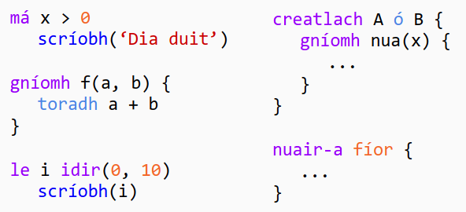

[](https://travis-ci.com/EoinDavey/Setanta)

# Setanta - Teanga Ríomhchlárúchain as Gaeilge

Seo é *Setanta*, an teanga ríomhchlárúcháin nua-aimseartha, simplí agus cairdiúil atá 100% as Gaeilge.

# *Setanta - Irish Programming Language*

*This is *Setanta*, the modern, simple and friendly programming language that's 100% in Irish.*



## Conas Setanta a fháil

Ban triail as Setanta ar [try-setanta.ie](https://try-setanta.ie) nó íoslódáil é ó NPM le

```
npm i -g setanta
```

## *How to get Setanta*

*Try Setanta at [try-setanta.ie](https://try-setanta.ie), or download it from NPM with*

```
npm i -g setanta
```

## Doiciméadacht

Tá teagasc as Gaeilge agus as Béarla ar fáil ar [try-setanta.ie](https://try-setanta.ie).

Féach ar doiciméadacht Setanta ar [docs.try-setanta.ie](http://docs.try-setanta.ie).

NB: Níl mo chuid Gaeilge foirfe, má tá botún nó earráid éigin ar an suíomh sin, le do thoil seol ríomhphost dom ar `eoind@vey.ie`, nó seol PR dom ar GitHub.

## *Documentation*

*There is a Setanta tutorial available in Irish and English on
[try-setanta.ie](https://try-setanta.ie).*

*Look at the Setanta documentation at [docs.try-setanta.ie](http://docs.try-setanta.ie).*

*NB: My Irish is not perfect. If there are any mistakes or errors on that site, please send me an email at `eoind@vey.ie`, or send a PR to me on GitHub.*

## CLI Úsáid

- Clóscríobh `setanta` isteach sa teirminéal chun REPL a oscailt.
- Clóscríobh `setanta <ainm comhad>` le comhad foinseach éigin chun an ríomhchlár a tosnú.

## *CLI Usage*

- *Type `setanta` into the terminal to open a REPL.*
- *Type `setanta <file name>` with some source file to start the program.*

## Stair Setanta

D'fhorbair mé Setanta mar chuid de mo thionscadal an bliana deiridh ag Ollscoil Mhá Nuad. Tá mo thráchtas le fheiceáil [anseo](https://github.com/EoinDavey/Setanta-thesis/blob/master/out/final-report.pdf).

Rinne mé Setanta mar thug mé faoi deara go raibh beagnach gach teanga ríomhchláruchain forbartha as Béarla. Theastaigh uaim teanga ríomchlárucháin a cruthú a bhí go hiomlán as Gaeilge ar feadh chúpla cúis.

- Chun doras a oscailt do dhaoine chun conas a ríomhchlárú a fhoghlaim trí mheán na Gaeilge.
- Chun an nasc idir Béarla agus na gnáth-theanga ríomhchláruchain a taiscéaladh. B'fhéidir go bhfuil naisc ann nach bhfuil soiléir.
- Chun feabhas a chur ar mo chuid Gaeilge. Ní cainteoir dúchais mé, thóg mé an deis seo chun mo chuid Gaeilge a chleachtadh, agus a neartú.


## *History of Setanta*

*I developed Setanta as part of my final year project at Maynooth University. My thesis can be seen [here](https://github.com/EoinDavey/Setanta-thesis/blob/master/out/final-report.pdf).*

*I made Setanta because I noticed that nearly all programming languages were developed in English. I wanted to create a programming language that was entirely in Irish for a few reasons.*

- *To open a door for people to learn how to program through Irish.*
- *To explore the connection between English and the usual programming languages. Maybe there are connections that are not very obvious.*
- *To improve my own Irish. I'm not a native speaker, I took this opportunity to practice and strengthen my Irish.*
